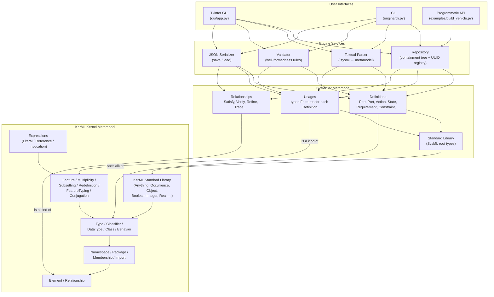
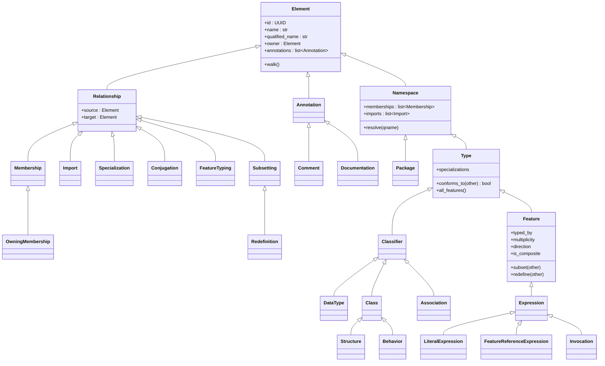
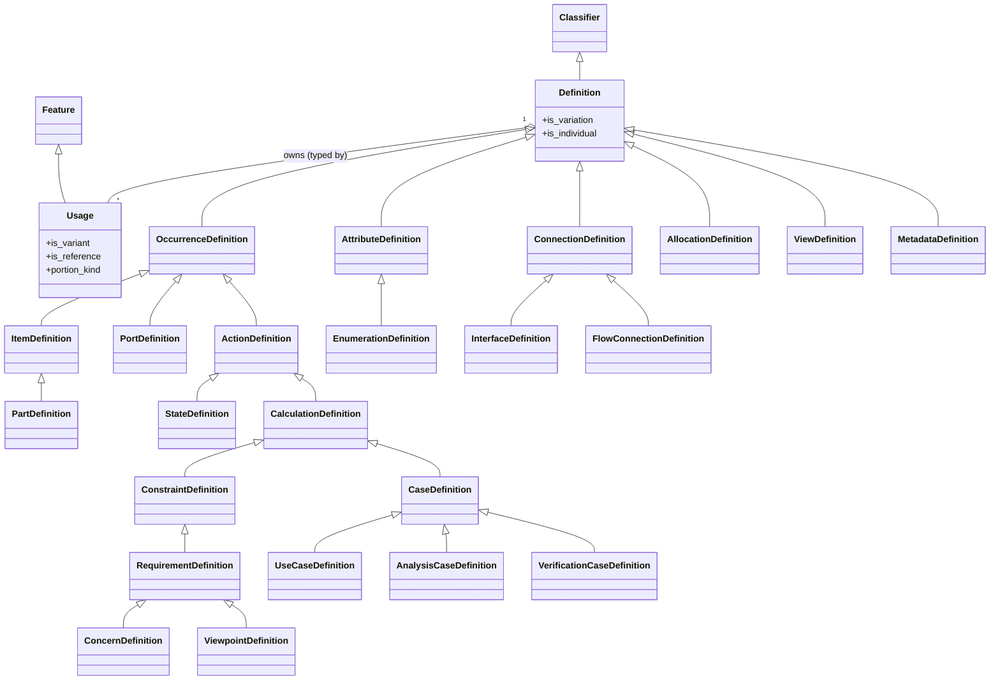
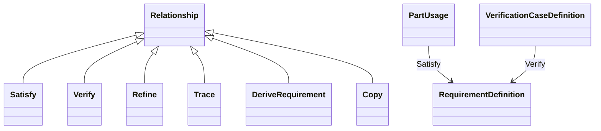
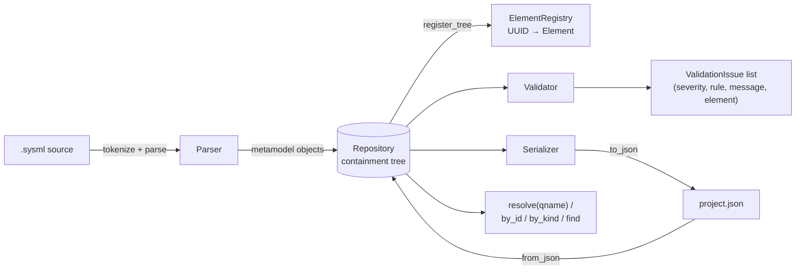
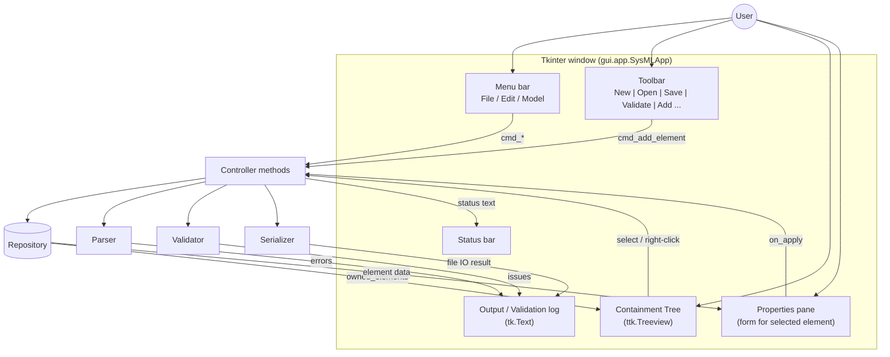
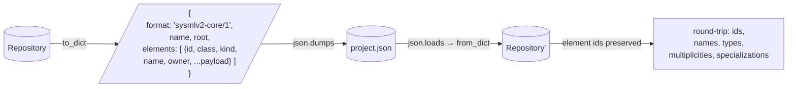
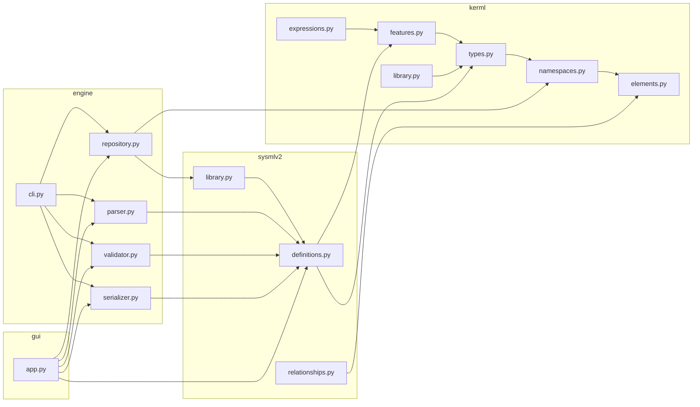

# Architecture

End-to-end architecture of the SysML v2 core engine, from the KerML
kernel up through the SysML v2 metamodel, the engine services, and the
Tkinter GUI front-end.

## 1. Layered overview



## 2. KerML metamodel (class view)



## 3. SysML v2 metamodel — Definition / Usage pattern



## 4. Modeling relationships



## 5. Engine services



## 6. GUI runtime



## 7. Typical user flow — “add a Part and validate”

```mermaid
sequenceDiagram
    actor U as User
    participant G as Tkinter GUI
    participant R as Repository
    participant M as SysML v2 Metamodel
    participant V as Validator

    U->>G: click "Part Def", name = "Vehicle"
    G->>M: PartDefinition(name="Vehicle")
    G->>R: parent.own(Vehicle); registry.register_tree
    R-->>G: ok
    G->>G: insert tree node, select it

    U->>G: edit properties (mass : Mass [1..1])
    G->>M: AttributeUsage(name="mass", typed_by=Mass)
    G->>R: Vehicle.own(usage)

    U->>G: F5 (Validate)
    G->>V: validate(repo)
    V->>R: iterate all elements
    V-->>G: list[ValidationIssue]
    G->>U: render issues in log + status bar
```

## 8. Persistence format (JSON)



## 9. Module map


