# Architecture

End-to-end architecture of the SysML v2 core engine. Eleven diagrams,
from the KerML kernel up through the SysML v2 metamodel, the engine
services, the GUI, the MCP server, and the knowledge-graph exporter.

## 1. Layered overview

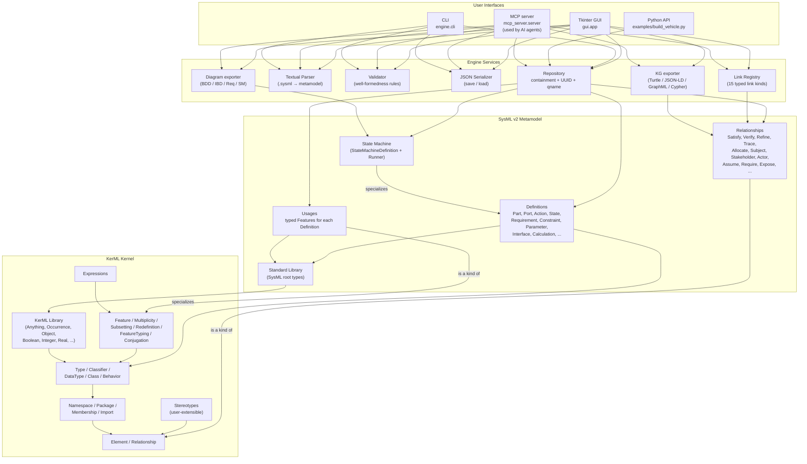

## 2. KerML metamodel (class view)

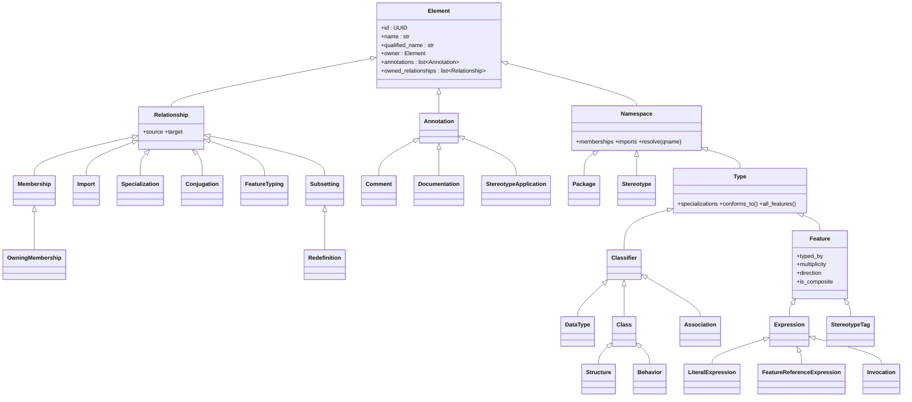

## 3. SysML v2 — Definition / Usage taxonomy

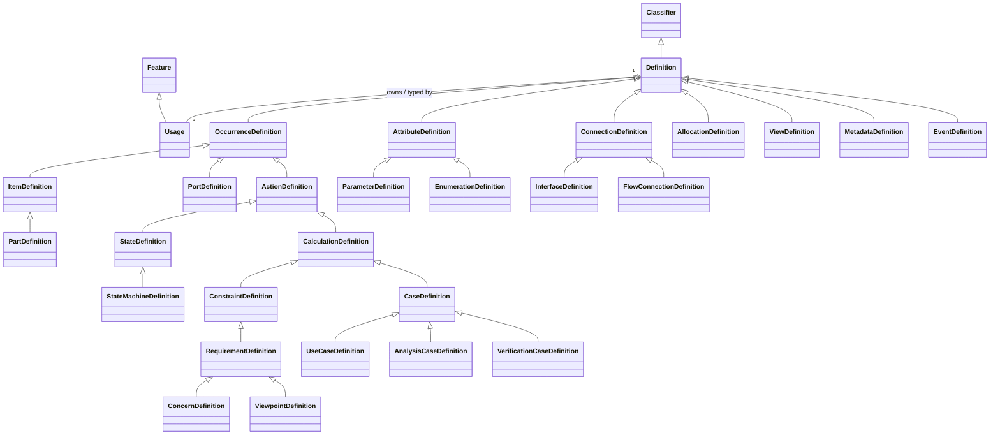

## 4. Link registry (15 typed link kinds)

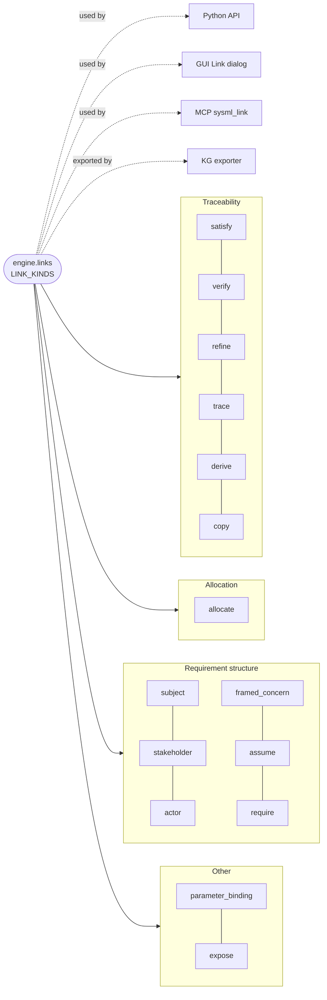

## 5. Engine services data-flow

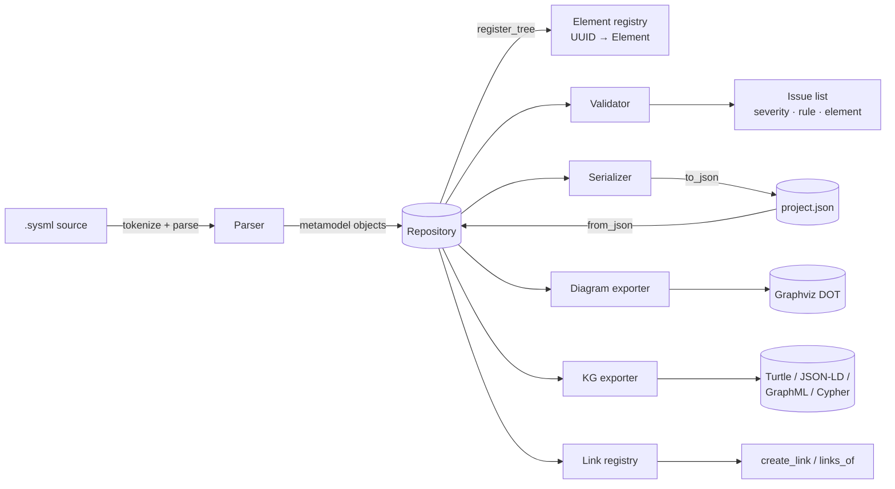

## 6. GUI runtime

```mermaid
flowchart TB
    subgraph TK["Tkinter window — gui.app.SysMLApp"]
        MENU["File · Edit · Model · StateMachine · Links · Stereotypes · Export"]
        TOOL["Toolbar (Add: Part / Attribute / Port / ... / Parameter / Stereotype)"]
        TREE["Containment tree (ttk.Treeview)"]
        subgraph NB[Right pane — Notebook]
            PROPS["Properties tab"]
            DIAGV["Diagram tab<br/>(BDD · IBD · Requirements · StateMachine)"]
        end
        LOG["Output / Validation log"]
        STATUS["Status bar"]
        DLG["Dialogs: LinkDialog, RequirementDialog"]
    end
    USER((User)) --> MENU & TOOL & TREE & PROPS
    MENU & TOOL --> CTRL[Controller methods<br/>(cmd_*)]
    TREE --> CTRL
    PROPS --> CTRL
    DLG --> CTRL
    CTRL --> REPO[(Repository)]
    CTRL --> PARSER[Parser]
    CTRL --> VALID[Validator]
    CTRL --> SER[Serializer]
    CTRL --> LINKS[Link registry]
    CTRL --> DIAG[Diagram exporter]
    CTRL --> KG[KG exporter]
    REPO --> TREE
    REPO --> PROPS
    REPO --> DIAGV
    VALID --> LOG
```

## 7. State machine runtime

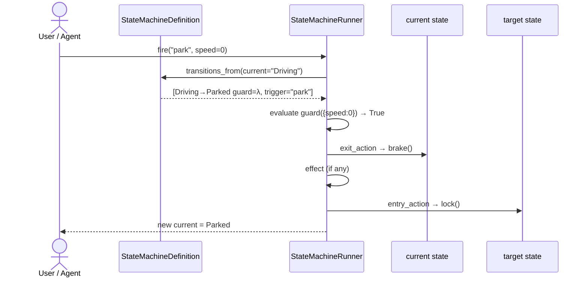

## 8. MCP server protocol

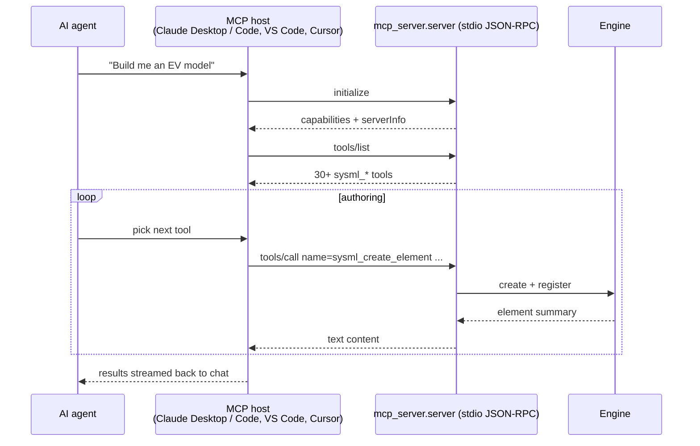

Tool surface (≈ 30 tools) grouped by family:

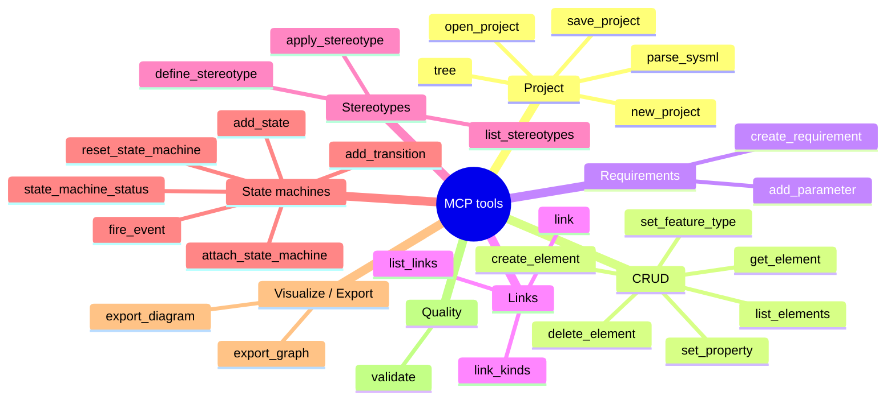

## 9. Knowledge-graph export

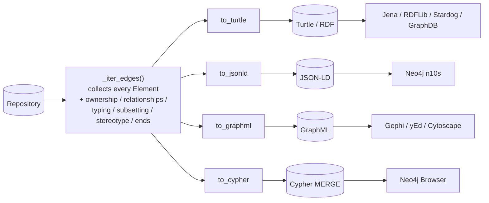

## 10. Persistence format

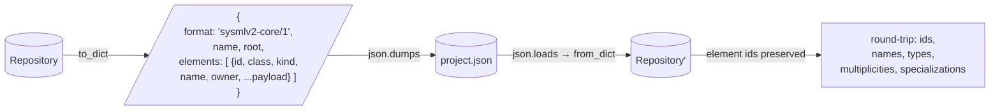

## 11. Module dependency map

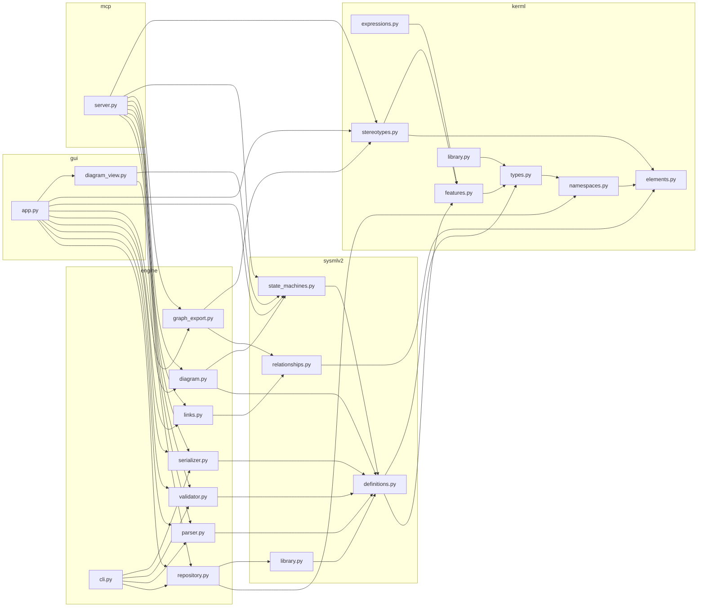
