# SysML v2 Core Engine — Visual User Guide

This is a hands-on, diagram-driven tour of every capability in the
engine. Every section ends with a runnable snippet (Python and/or the
matching MCP tool call) so you can reproduce it yourself.

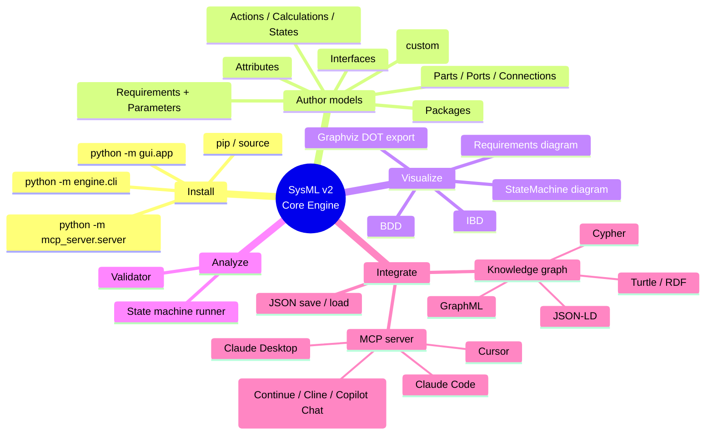

---

## 1. Install & run

```bash
git clone <repo>
cd REQUIREMENT-FORMALISER
python -m unittest discover -s tests -v     # 43 tests, all pass

# Three surfaces, pick any:
python -m engine.cli examples/vehicle.sysml  # parse + validate + print
python -m gui.app                            # desktop GUI (needs Tk)
python -m mcp_server.server                  # MCP over stdio
```

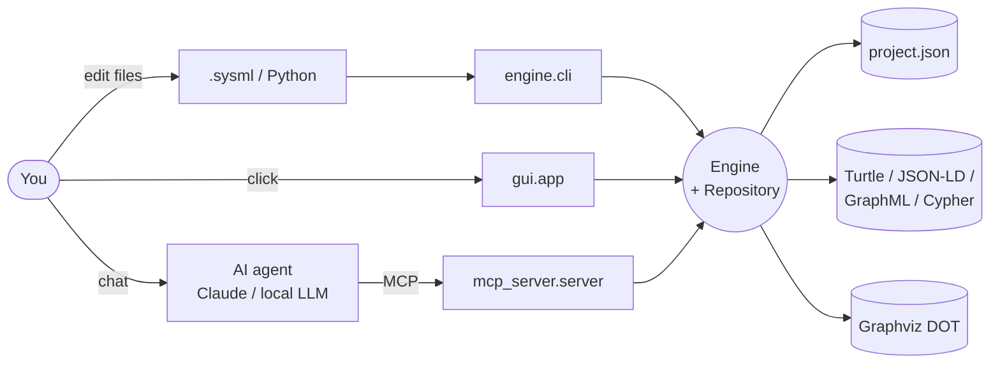

---

## 2. The Definition / Usage pattern

Every domain concept in SysML v2 has two halves. Remember this — it's
the rule that explains the whole metamodel.

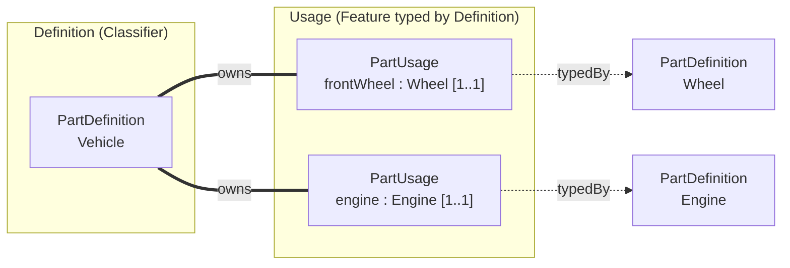

| Kind             | Definition class          | Usage class             |
|------------------|---------------------------|-------------------------|
| structure        | `PartDefinition`          | `PartUsage`             |
| item             | `ItemDefinition`          | `ItemUsage`             |
| attribute        | `AttributeDefinition`     | `AttributeUsage`        |
| port             | `PortDefinition`          | `PortUsage`             |
| interface        | `InterfaceDefinition`     | `InterfaceUsage`        |
| connection       | `ConnectionDefinition`    | `ConnectionUsage`       |
| action           | `ActionDefinition`        | `ActionUsage`           |
| state            | `StateDefinition`         | `StateUsage`            |
| calculation      | `CalculationDefinition`   | `CalculationUsage`      |
| constraint       | `ConstraintDefinition`    | `ConstraintUsage`       |
| requirement      | `RequirementDefinition`   | `RequirementUsage`      |
| parameter        | `ParameterDefinition`     | `ParameterUsage`        |
| enumeration      | `EnumerationDefinition`   | `EnumerationUsage`      |

---

## 3. The GUI in 60 seconds

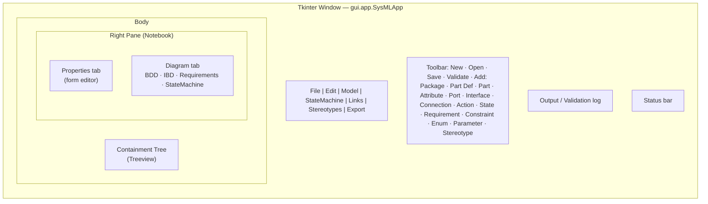

**Workflow**

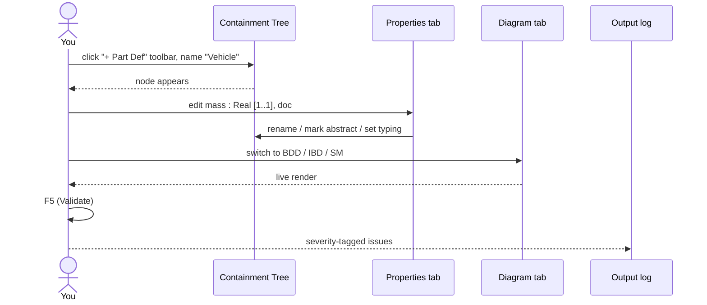

Key shortcuts: **F2** rename · **Del** delete · **F5** validate · **Ctrl+L** create link · **Ctrl+E** fire event.

---

## 4. Authoring a model — three vehicles in three ways

The same model can be built in three equivalent ways.

### 4a. Textual `.sysml`

```sysml
package Vehicles {
    attribute def Mass;
    port def MechanicalPort;
    part def Engine {
        attribute power : Mass;
        port shaft     : MechanicalPort;
    }
    part def Vehicle {
        attribute mass : Mass;
        part engine    : Engine;
    }
}
```

Run: `python -m engine.cli vehicle.sysml`.

### 4b. Python builder

```python
from engine import Repository
from sysmlv2 import (
    AttributeDefinition, AttributeUsage,
    PartDefinition, PartUsage,
    PortDefinition, PortUsage,
)
repo = Repository("VehicleProject")
Mass = repo.add(AttributeDefinition(name="Mass"))
Mech = repo.add(PortDefinition(name="MechanicalPort"))
Engine = repo.add(PartDefinition(name="Engine"))
Engine.own(AttributeUsage(name="power", typed_by=Mass))
Engine.own(PortUsage(name="shaft", typed_by=Mech))
Vehicle = repo.add(PartDefinition(name="Vehicle"))
Vehicle.own(AttributeUsage(name="mass", typed_by=Mass))
Vehicle.own(PartUsage(name="engine", typed_by=Engine))
repo.validate()
repo.save("vehicle.json")
```

### 4c. MCP (driven by an AI agent)

```jsonc
// Tool calls an LLM would emit
{"name": "sysml_create_element", "arguments": {"kind": "PartDefinition",        "name": "Vehicle"}}
{"name": "sysml_create_element", "arguments": {"kind": "AttributeDefinition",   "name": "Mass"}}
{"name": "sysml_create_element", "arguments": {"kind": "AttributeUsage",
                                                "name": "mass", "parent": "Vehicle",
                                                "properties": {"typed_by": "Mass"}}}
{"name": "sysml_validate"}
```

---

## 5. Block Definition Diagram (BDD)

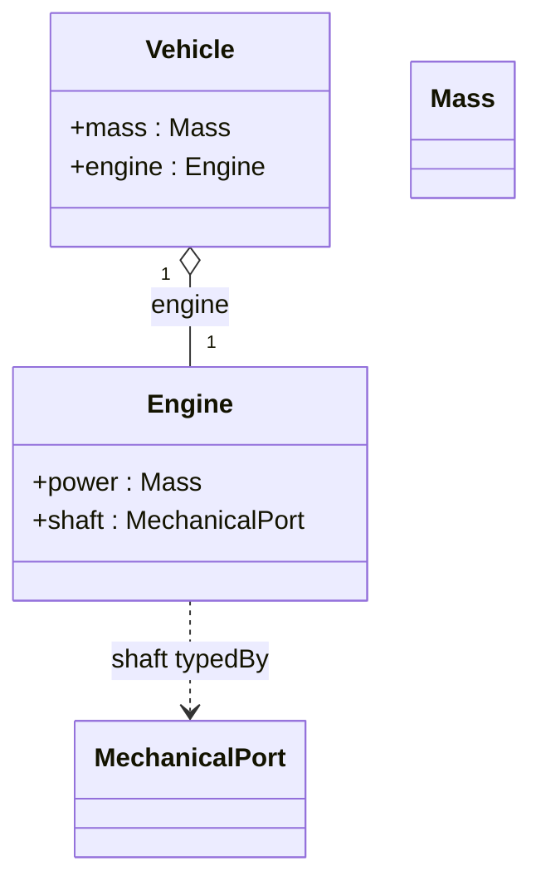

GUI: Diagram tab → BDD. Programmatic: `engine.bdd(repo.root_package)` returns Graphviz DOT.

---

## 6. Internal Block Diagram (IBD)

Internal structure of one part: nested usages + ports + connections.

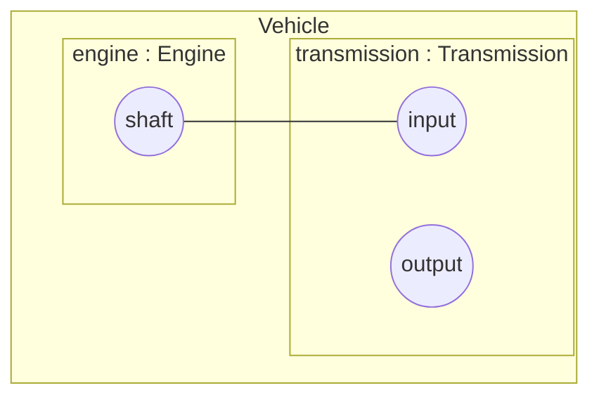

```python
from sysmlv2 import ConnectionUsage
v = ...   # PartDefinition
v.own(ConnectionUsage(name="drivetrain", ends=[engine_shaft, trans_input]))
```

GUI: select a Part, switch Diagram tab to **IBD**.

---

## 7. Requirements with subject / stakeholders / actors

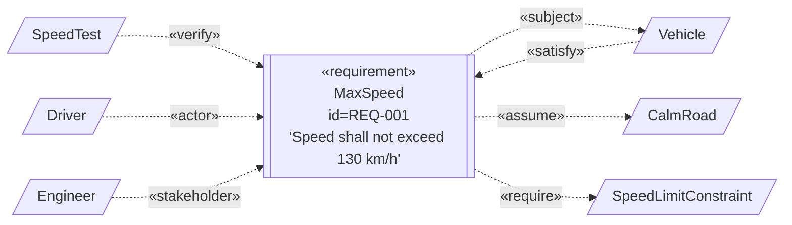

```python
from engine import create_link
from sysmlv2 import RequirementDefinition, VerificationCaseDefinition

req = RequirementDefinition(name="MaxSpeed", req_id="REQ-001",
                            text="Speed shall not exceed 130 km/h.")
project.own(req)
create_link("subject",     req, vehicle)
create_link("satisfy",     vehicle, req)
create_link("verify",      VerificationCaseDefinition(name="SpeedTest"), req)
create_link("actor",       req, driver)
create_link("stakeholder", req, engineer)
```

The **15 link kinds**, all addressable by name:

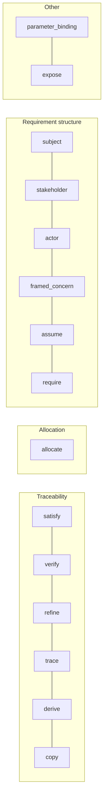

GUI: **Links** menu → Create link… (Ctrl+L). MCP: `sysml_link kind=… source=… target=…`.

---

## 8. Parameters on actions / calculations / constraints

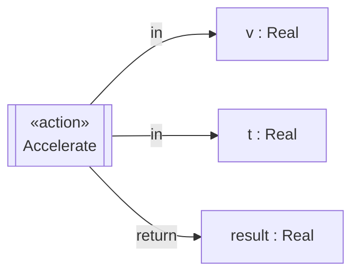

```python
from sysmlv2 import ActionDefinition, AttributeDefinition, ParameterUsage
Real = AttributeDefinition(name="Real")
accel = ActionDefinition(name="Accelerate")
accel.own(ParameterUsage(name="v",      parameter_kind="in",     typed_by=Real))
accel.own(ParameterUsage(name="t",      parameter_kind="in",     typed_by=Real))
accel.own(ParameterUsage(name="result", parameter_kind="return", typed_by=Real))
```

`parameter_kind` is `in`, `out`, `inout`, or `return`. MCP: `sysml_add_parameter`.

---

## 9. State machines — one per Part (or many)

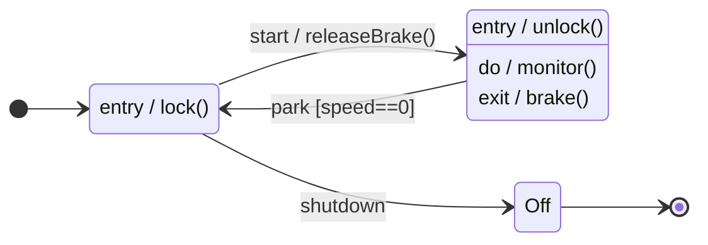

```python
sm = vehicle.attach_state_machine("VehicleSM")
parked  = sm.add_state("Parked",  entry="lock()", is_initial=True)
driving = sm.add_state("Driving", entry="unlock()", do="monitor()", exit="brake()")
off     = sm.add_state("Off", is_final=True)
sm.add_transition(parked,  driving, trigger="start", effect="releaseBrake()")
sm.add_transition(driving, parked,  trigger="park",  guard=lambda c: c.get("speed", 0) == 0)
sm.add_transition(parked,  off,     trigger="shutdown")

r = sm.runner()
r.fire("start")          # → Driving
r.fire("park", speed=10) # guard blocks → stays Driving
r.fire("park", speed=0)  # → Parked
r.fire("shutdown")       # → Off (final)
```

**Runtime sequence inside `fire("park", speed=0)`:**

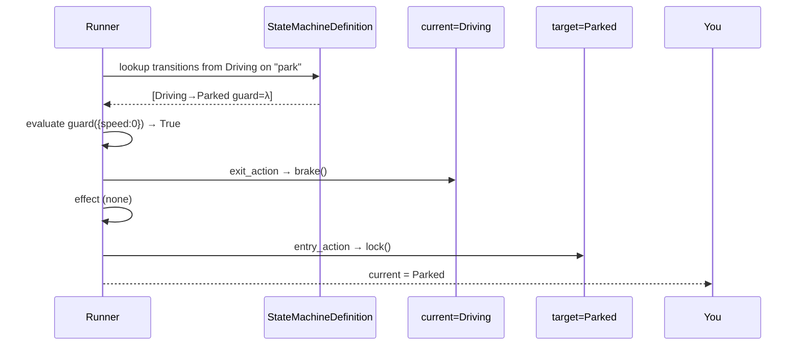

GUI: **StateMachine** menu (Attach, Add state, Add transition, Fire event Ctrl+E, Reset).
MCP: `sysml_attach_state_machine`, `sysml_add_state`, `sysml_add_transition`, `sysml_fire_event`, `sysml_state_machine_status`, `sysml_reset_state_machine`.

---

## 10. Custom stereotypes (your own profile, in 4 lines)

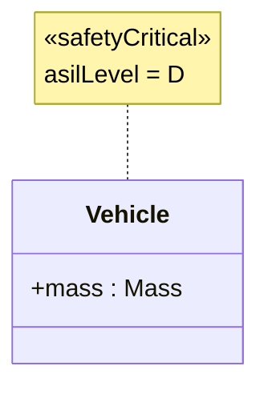

```python
from kerml.stereotypes import Stereotype
from sysmlv2 import PartDefinition

safety = Stereotype(name="safetyCritical", applies_to=[PartDefinition])
safety.define_tag("asilLevel", default="QM")
project.own(safety)

safety.apply(vehicle, {"asilLevel": "D"})   # validated at apply time
```

Stereotypes round-trip through JSON, appear in every diagram, and serialize to the knowledge-graph as `:stereotype` edges with tag values.

---

## 11. Validation

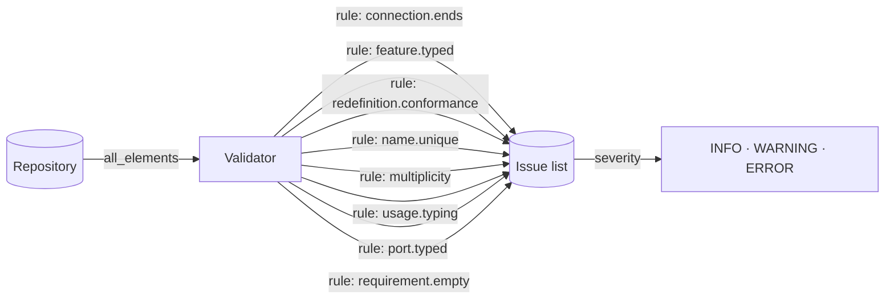

```bash
python -m engine.cli examples/vehicle.sysml          # validates by default
```

GUI: **F5** or Model → Validate. MCP: `sysml_validate`.

---

## 12. Knowledge graph export

Export the entire project as a graph any KG tool can ingest.

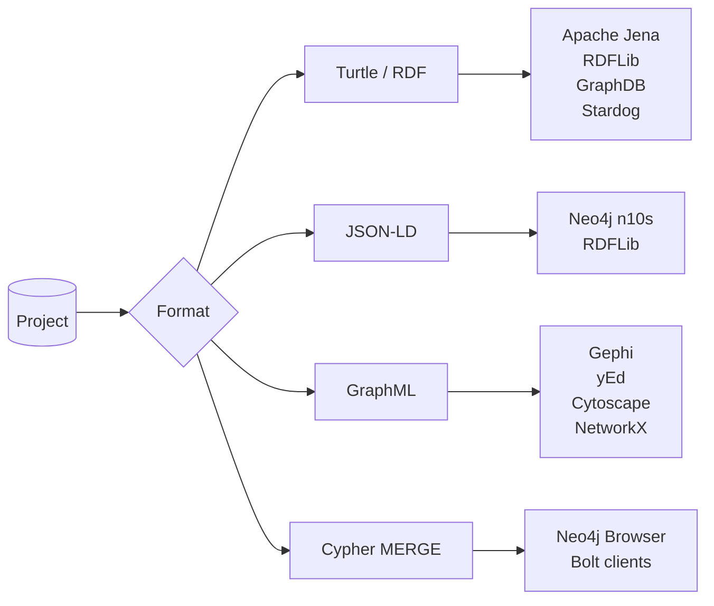

```python
from engine import export_knowledge_graph
print(export_knowledge_graph(repo.root_package, "turtle")[:200])
```

GUI: **Export** menu → Knowledge graph: turtle / json-ld / graphml / cypher.
MCP: `sysml_export_graph format="turtle"`.

Every node is `:Kind` with `name`, `qualified_name`, etc. Every link is
a typed edge — `owns`, `specializes`, `subsets`, `redefines`,
`typedBy`, `satisfies`, `verifies`, `refines`, `traces`,
`derivesFrom`, `connects`, `imports`, `stereotype`, ... — so SPARQL,
Cypher, Gremlin queries all work.

Example Cypher (after loading the export):

```cypher
// Every part that satisfies a 'safety' requirement
MATCH (p:PartDefinition)-[:SATISFIES]->(r:RequirementDefinition)
WHERE r.text CONTAINS "safety"
RETURN p.name, r.req_id, r.text;
```

---

## 13. MCP — drive everything from an AI agent

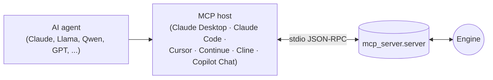

The server speaks the MCP 2024-11-05 protocol over stdio (stdlib only,
zero deps). It exposes **30+ tools** across these families:

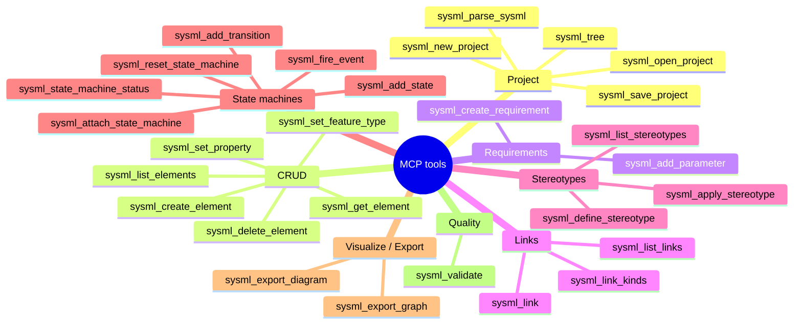

Wire-up (workspace-level, bundled in `.vscode/mcp.json`):

```jsonc
{ "servers": { "sysmlv2-core": {
  "type": "stdio",
  "command": "python", "args": ["-m", "mcp_server.server"],
  "cwd": "${workspaceFolder}",
  "env": { "PYTHONPATH": "${workspaceFolder}" }
}}}
```

See [LOCAL_LLM_VSCODE.md](LOCAL_LLM_VSCODE.md) for Ollama + Continue / Cline / Copilot Chat setup.

---

## 14. End-to-end example — "Design and verify a vehicle"

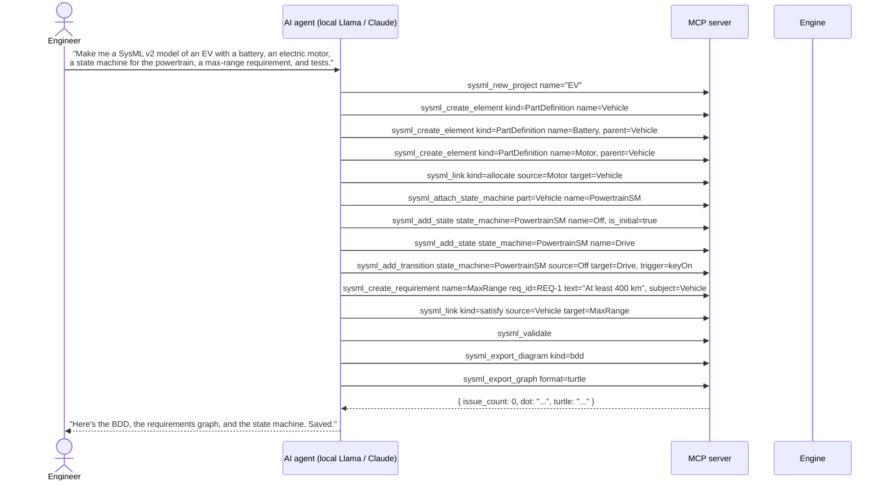

That's the loop: human → LLM → MCP → engine → diagrams / KG → human.
Every step above is also reachable from the GUI menus and the Python
API.

---

## 15. Cheat sheet

| Task                            | Python                                   | GUI                          | MCP tool                       |
|---------------------------------|------------------------------------------|------------------------------|--------------------------------|
| New project                     | `Repository("X")`                        | File ▸ New                   | `sysml_new_project`            |
| Open / Save JSON                | `Repository.load/save`                   | File ▸ Open/Save             | `sysml_open_project / save`    |
| Parse `.sysml`                  | `engine.parse(src, into=...)`            | File ▸ Import .sysml         | `sysml_parse_sysml`            |
| Add element                     | `Repository.add(cls(name=…))`            | Toolbar ▸ Kind               | `sysml_create_element`         |
| Type a feature                  | `f.add_type(t)`                          | Properties ▸ Typed by        | `sysml_set_feature_type`       |
| Add parameter                   | `act.own(ParameterUsage(...))`           | Links ▸ Add parameter        | `sysml_add_parameter`          |
| Connect ports                   | `ConnectionUsage(ends=[a,b])`            | Toolbar ▸ Connection         | `sysml_connect`                |
| Create typed link               | `engine.create_link("satisfy",a,b)`      | Links ▸ Create link (Ctrl+L) | `sysml_link`                   |
| Create requirement              | `RequirementDefinition(...)`             | Links ▸ New requirement      | `sysml_create_requirement`     |
| Define stereotype               | `Stereotype("x"); project.own(s)`        | Stereotypes ▸ Define         | `sysml_define_stereotype`      |
| Apply stereotype                | `s.apply(target, {…})`                   | Stereotypes ▸ Apply          | `sysml_apply_stereotype`       |
| Attach state machine            | `part.attach_state_machine("SM")`        | StateMachine ▸ Attach        | `sysml_attach_state_machine`   |
| Add state / transition          | `sm.add_state(...)`/ `add_transition`    | StateMachine ▸ Add …         | `sysml_add_state/_transition`  |
| Fire event                      | `sm.runner().fire("e", …)`               | StateMachine ▸ Fire (Ctrl+E) | `sysml_fire_event`              |
| Validate                        | `Validator().validate(repo)`             | Model ▸ Validate (F5)        | `sysml_validate`               |
| Export DOT                      | `engine.bdd/ibd/state_machine/...`       | Diagram ▸ Export DOT…        | `sysml_export_diagram`         |
| Export knowledge graph          | `export_knowledge_graph(root, "turtle")` | Export ▸ Knowledge graph     | `sysml_export_graph`           |
